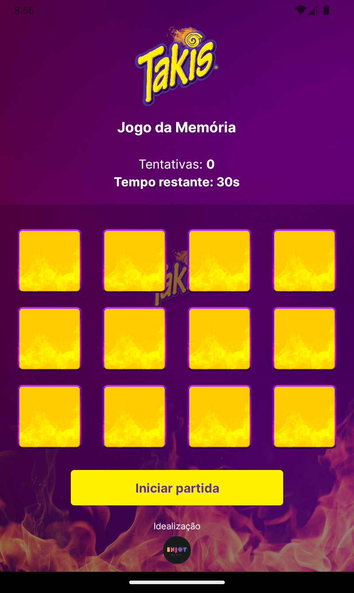
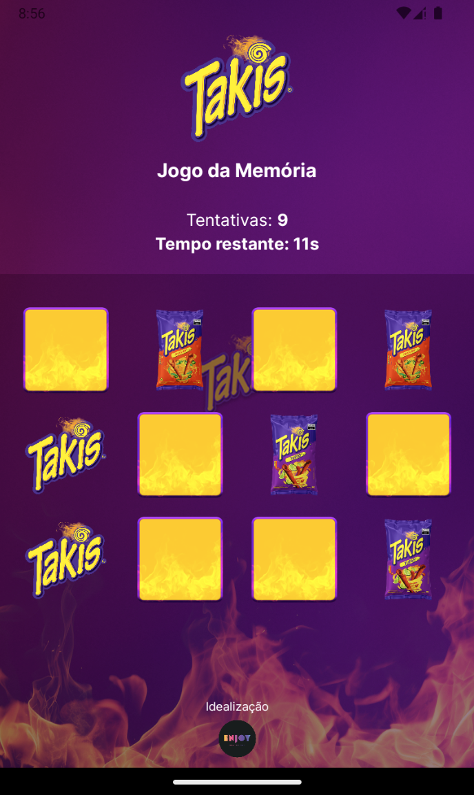
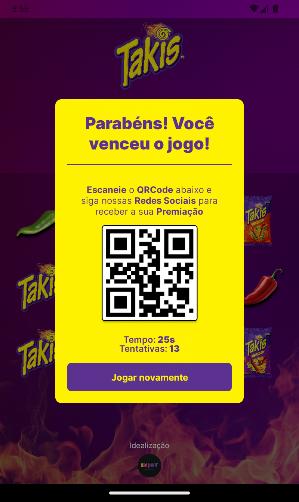

# Takis: Jogo da Memória

  
  
  

> Jogo da memória desenvolvido especialmente para uma campanha promocional dos salgadinhos Takis. O aplicativo foi pensado para tablets, possui cronômetro, contador de tentativas e uma interface personalizada com elementos gráficos da marca.

[📥 Clique aqui para baixar o APK](https://github.com/Emanuel-Boaventura/takis-memory-game/releases/tag/v1.0.0/takis-game.apk)

## 🛠 Tecnologias utilizadas

- React Native
- Expo

## Vídeo Demonstrativo

[takis-video.webm](https://github.com/user-attachments/assets/e1fefc9c-73f7-4365-8911-7cc29ddffb6f)

## 💛 Contato

- <emanuelbm.dev@gmail.com>
- [linkedin.com/in/emanuelboaventura](https://www.linkedin.com/in/emanuelboaventura/)
- [Portfólio](https://emanuelboaventura.com/)
